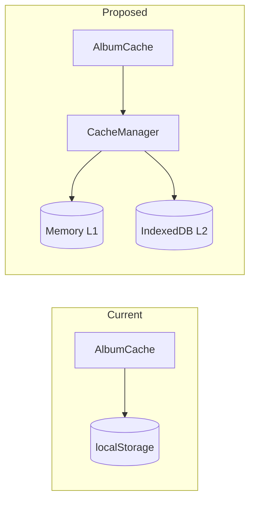

# ARCH-5: Cache Consolidation Specification
**Status**: 📋 DRAFT - Awaiting Review  
**Date**: 2025-12-26  
**Author**: AI Agent  
**Sprint**: 14

---

## 1. Problem Statement

### Current State
The application has **two parallel cache systems** that are not integrated:

| System | L1 | L2 | Status |
|--------|----|----|--------|
| **AlbumCache** | Memory Map | localStorage (5MB limit) | ✅ Active |
| **CacheManager** | MemoryCache | IndexedDB (500MB+) | ❌ Dead code |

### Problems
1. **Dead Code**: CacheManager/IndexedDB exists but is never used
2. **Storage Limit**: localStorage caps at ~5MB (~500-1000 albums max)
3. **Inconsistent Keys**: Query strings are case-sensitive, causing cache misses
4. **No Unified API**: Direct localStorage usage scattered across codebase

---

## 2. Proposed Solution

**Migrate AlbumCache to use CacheManager as its storage backend.**

### Key Changes
1. AlbumCache becomes a **facade** over CacheManager
2. Replace localStorage L2 with IndexedDB L2
3. Normalize cache keys (lowercase, trimmed)
4. Add migration path for existing localStorage data

---

## 3. Success Criteria

| # | Criteria | Validation |
|---|----------|------------|
| 1 | Albums cached in IndexedDB, not localStorage | DevTools → Application → IndexedDB |
| 2 | Existing cached albums migrated automatically | No re-fetch on first load after deploy |
| 3 | Cache key normalized (case-insensitive) | `"Pink Floyd - The Wall"` = `"pink floyd - the wall"` |
| 4 | No regression in album loading flow | Manual test: Load series, refresh, verify cache hits |
| 5 | Dead code removed or repurposed | MemoryCache.js removed if redundant |

---

## 4. Out of Scope

- Auth token storage migration (future task)
- User preferences storage (viewMode, currency)
- Spotify enrichment cache
- Server-side caching

---

## 5. Risks & Mitigations

| Risk | Severity | Mitigation |
|------|----------|------------|
| Regression in album loading | 🔴 HIGH | Feature flag + fallback to localStorage |
| Data loss on migration | 🟠 MED | Read from both, write to new only |
| IndexedDB unavailable (Safari private) | 🟡 LOW | CacheManager already has fallback logic |

---

## 6. Dependencies

- `public/js/cache/CacheManager.js` (exists, needs integration)
- `public/js/cache/IndexedDBCache.js` (exists, used by CacheManager)
- `public/js/cache/albumCache.js` (refactor target)
- `public/js/api/client.js` (consumer, minimal changes)

---

## 7. Decisions (Approved 2025-12-26)

| Question | Decision |
|----------|----------|
| Migration fallback window | **7 days** (matches TTL) |
| Feature flag toggle | **No** (read-from-both is sufficient) |
| Cleanup MemoryCache.js | **Yes**, if replaceable by native Map |

---

## Approval

- [x] **USER APPROVED** - 2025-12-26 10:18
