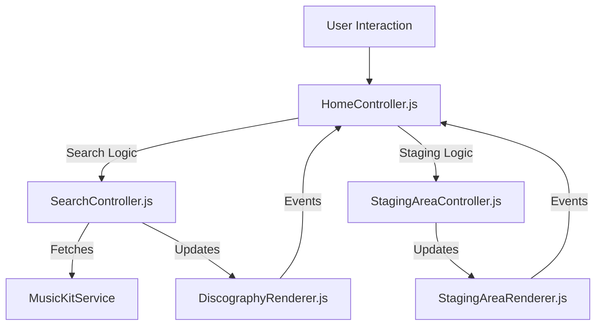

# ARCH-11: HomeView V3 ("The Album Blender") Specification

## 1. Overview
**Goal**: Refactor `HomeView.js` (currently monolithic) into a modular V3 Architecture (Controller + Renderer) and implement the "Split-Panel" design inspired by Nano Banana aesthetics.
**Status**: IN PROGRESS
**Prototype**: `public/static_prototype_v3.html` (Visual Reference)

## 2. Architecture Diagram (V3 Pattern)

## 3. UI Design: The Split Panel (Nano Style)
A 40/60 Split Layout with "Flame Gradient" and Glassmorphism.

### Left Panel (40%): Control Deck
- **Series Name**: Sticky input.
- **Input Controllers**:
    - **Visual Mode**: Search Bar + Autocomplete.
    - **Bulk Mode**: Textarea (Validation integrated).
- **Staging Stack**: A list of selected albums (Drawer on Mobile).
- **Action**: "Initialize Load Sequence" sticky footer.

### Right Panel (60%): Results Matrix
- **Header**: Breadcrumbs + Filters (Album/Single/Live) + Toggles.
- **Grid**: Infinite scroll discography.
- **Sorting**: **Release Date (Newest -> Oldest)** [Default].

## 4. Components Plan

### [NEW] `public/js/controllers/HomeController.js`
- **Role**: Orchestrator. Replaces `HomeView.js`.
- **State**: `viewMode` (Visual/Bulk), `isScanning`, `seriesName`.

### [NEW] `public/js/components/home/SearchController.js`
- **Role**: Manages the Artist Search pipeline.
- **Dependencies**: `AlbumSearchService`, `MusicKitService`.

### [NEW] `public/js/views/renderers/DiscographyRenderer.js`
- **Role**: Renders the toggleable grid in the Right Panel.
- **Features**: 
    - Hover effects ("Flying Album").
    - Badge rendering (Deluxe/Remaster).
    - Sorting logic (Newest First).

### [NEW] `public/js/views/renderers/StagingAreaRenderer.js`
- **Role**: Renders the stack in the Left Panel.
- **Features**: Drag-drop reordering, remove buttons.

## 5. Mobile & Hero Strategy
- **Mobile**: Panels stack vertically. Left Panel (Controls) acts as a flexible drawer.
- **Hero**: **Full-Screen Dynamic Background** (Flame Animation) replaces static banners.

## 6. Implementation Steps
1. **Scaffold**: Create folder structure `public/js/components/home/`.
2. **Prototype Integration**: Port `static_prototype_v3.html` HTML to `HomeView.js` (or `HomeRenderer.js`).
3. **Logic Migration**: Move search/staging logic to Controllers.
4. **Verification**: Match functionality with the Prototype.
