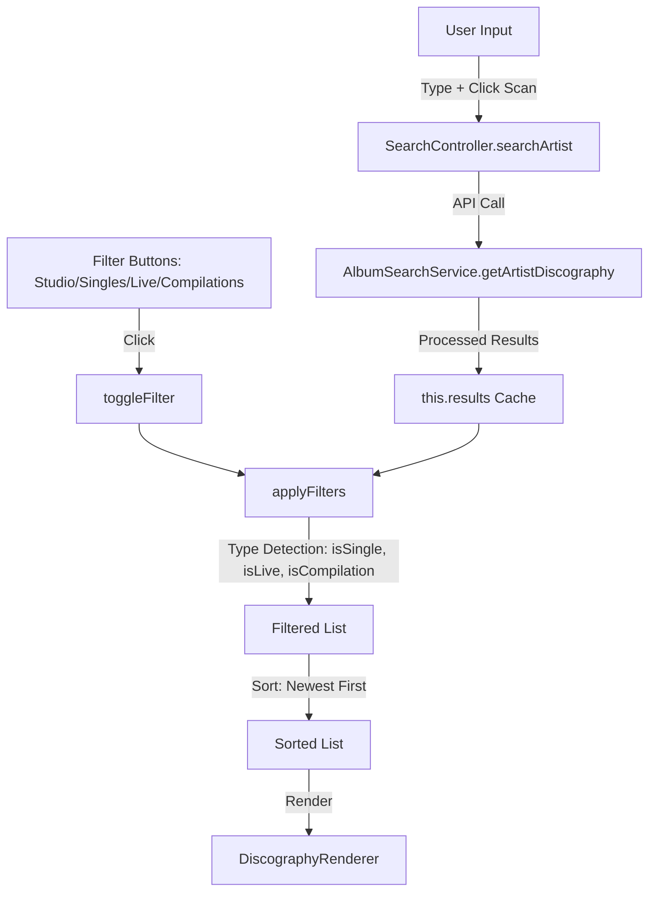
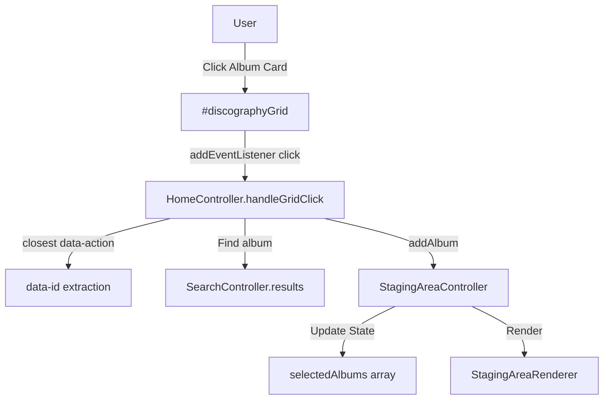
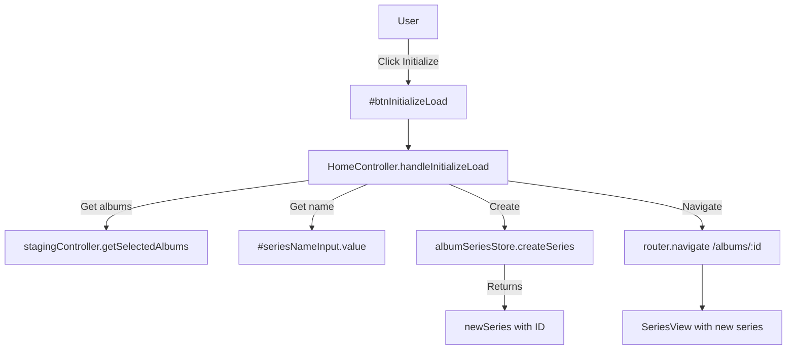

# Plan: HomeView V3 Restoration & UX Polish

**Feature**: HomeView V3 Refactor (ARCH-11) - Phase 2: Functional Parity & UX
**Status**: ✅ IMPLEMENTED
**Last Updated**: 2025-12-28
**Related Spec**: `arch-11-home-v3-spec.md`
**Tasks**: `tasks.md`

## 1. Goal
Restore core functionalities (Filters, Staging) lost during the V3 refactor and improve the UX for Search and Staging interactions. Achieve parity with the previous version using the new V3 architecture and "Nano/Flame" aesthetic.

**Outcome**: All goals achieved. HomeView V3 is fully functional with improved UX.

## 2. Architecture & Logic Flows (Implemented)

### 2.1 Search & Filter Pipeline
Client-side filtering with cached results.



### 2.2 Staging Interaction (Event Delegation)
Fixed using direct event registration instead of inline handlers.



### 2.3 Initialize Load Sequence (New)
Full series creation workflow.



## 3. UI/UX Strategy (Implemented)

### 3.1 Labels & Sections
Restored intuitive labels matching UI Style Guide:
- **01 // Series Configuration** + sublabel "Your Albums Series Name"
- **02a // Artist Filter** (replaced technical "INPUT METHOD")
- **03 // Selected Albums** (replaced jargon "STAGING STACK")

### 3.2 Filter Toolbar (Right Panel)
```
[ Discography Scan > Artist Name ]   [Studio] [Singles/EP] [Live] [Compilations]
                                     (Active=Orange gradient, Inactive=Gray)
```

### 3.3 Scan Button
- Visible orange gradient button "Scan" next to input
- Replaces hidden icon-only button

### 3.4 Mobile Responsiveness
- Panels stack vertically
- Filters scroll horizontally with hidden scrollbar
- Breadcrumbs hidden on small screens

### 3.5 Staging Area
- Remove button always visible (not hover-dependent)
- Larger touch target with red background
- X icon rendered via `getIcon('X')`

## 4. Implementation Summary

| Step | Description | Status |
|------|-------------|--------|
| 1 | Fix event delegation (direct registration) | ✅ Done |
| 2 | Implement filters (4 categories) | ✅ Done |
| 3 | Add loading feedback | ✅ Done |
| 4 | Fix staging UI (remove button) | ✅ Done |
| 5 | Add album badges | ✅ Done |
| 6 | Integrate SortableJS for D&D | ✅ Done |
| 7 | Restore intuitive labels | ✅ Done |
| 8 | Fix mobile layout | ✅ Done |
| 9 | Implement Initialize Load | ✅ Done |
| 10 | Fix AlbumsScopedRenderer bug | ✅ Done |

## 5. Files Modified

| File | Changes |
|------|---------|
| `HomeView.js` | Labels, mobile layout, filter buttons, scan button |
| `HomeController.js` | Event delegation, Initialize Load with navigation |
| `SearchController.js` | Compilations filter, improved type detection |
| `DiscographyRenderer.js` | Entire card clickable, badges, visual feedback |
| `StagingAreaRenderer.js` | Always visible remove button with getIcon |
| `AlbumSearchService.js` | Proper album type flags in _processDiscography |
| `AlbumsScopedRenderer.js` | Handle both string and object albumQueries |
| `neon.css` | scrollbar-hide utility |

## 6. Validation Results

| Test | Result |
|------|--------|
| Search "Led Zeppelin" | ✅ 27 albums fetched, 9 studio filtered |
| Toggle filters | ✅ Immediate client-side update |
| Click album to stage | ✅ Adds to Selected Albums |
| Click X to remove | ✅ Removes from stack |
| Initialize Load | ✅ Creates series, navigates to /albums/:id |
| Mobile layout | ✅ Panels stack, filters scroll |
| Badges display | ✅ Deluxe, Remaster, Live badges visible |
