# ARCH-18: Album Classification Modularization - Plan

**Sprint**: 17.75
**Created**: 2026-01-06
**Status**: 📋 AWAITING APPROVAL
**Prerequisite**: [spec.md](spec.md) ✅ COMPLETE

---

## 1. Logic Flow: Classification Pipeline

```mermaid
flowchart TD
    START[Album Input] --> A1{AppleMetadataStrategy}
    
    A1 -->|isSingle=true| SINGLE[🎵 Single]
    A1 -->|isCompilation=true| COMP[📀 Compilation]
    A1 -->|no flags| A2
    
    A2{TitleKeywordStrategy}
    A2 -->|live, unplugged| LIVE[🎤 Live]
    A2 -->|dj mix, asot| COMP
    A2 -->|"- single"| SINGLE
    A2 -->|"- ep"| EP[💿 EP]
    A2 -->|remixes, best of| COMP
    A2 -->|no match| A3
    
    A3{RemixTracksStrategy}
    A3 -->|"≥50% tracks = remix"| REMIX_CHECK{trackCount?}
    REMIX_CHECK -->|"≤6"| SINGLE
    REMIX_CHECK -->|">6"| EP
    A3 -->|"<50% remix"| A4
    
    A4{TrackCountStrategy}
    A4 -->|"1-3 tracks, <20min"| SINGLE
    A4 -->|"4-6 tracks, <30min"| EP
    A4 -->|"prog rock, ≥35min"| A5
    A4 -->|"7+ tracks"| A5
    
    A5{AIWhitelistStrategy}
    A5 -->|is electronic?| ELEC_CHECK{in AI list?}
    ELEC_CHECK -->|yes| ALBUM[🎹 Studio Album]
    ELEC_CHECK -->|no| UNCAT[❓ Uncategorized]
    A5 -->|not electronic| ALBUM
```



---

## 2. UI Mockup: Filter Bar with Counters

### Current State (Sem Contadores)
```
┌─────────────────────────────────────────────────────────────────┐
│  Show: [Albums] [Singles/EP] [Compilations] [Live]              │
│         ▲                                                       │
│         └── Não mostra quantos items estão em cada categoria    │
└─────────────────────────────────────────────────────────────────┘
```

### Proposed State (Com Contadores + Uncategorized)
```
┌─────────────────────────────────────────────────────────────────────────────────┐
│  Show: [Albums (6)] [Singles/EP (45)] [Compilations (8)] [Live (3)] [? (2)]     │
│                                                                      ▲          │
│                                                     Uncategorized ───┘          │
└─────────────────────────────────────────────────────────────────────────────────┘
```

### Visual Design (Tailwind Classes)
```html
<!-- Filter Button with Counter -->
<button class="filter-btn px-3 py-1.5 rounded-lg bg-flame-gradient text-white">
    Albums
    <span class="ml-1 px-1.5 py-0.5 text-xs bg-white/20 rounded-full">6</span>
</button>

<!-- Inactive Filter -->
<button class="filter-btn px-3 py-1.5 rounded-lg bg-white/5 text-gray-400 border border-white/5">
    Singles/EP  
    <span class="ml-1 px-1.5 py-0.5 text-xs bg-white/10 rounded-full">45</span>
</button>

<!-- Uncategorized (special) -->
<button class="filter-btn px-3 py-1.5 rounded-lg bg-amber-500/20 text-amber-400 border border-amber-500/30">
    ?
    <span class="ml-1 px-1.5 py-0.5 text-xs bg-amber-500/20 rounded-full">2</span>
</button>
```

---

## 3. Component Strategy

### 3.1 Backend (Classification Pipeline)

| Component | Responsibility | Dependencies |
|:----------|:---------------|:-------------|
| `AlbumTypeClassifier` | Orchestrator, runs pipeline | All strategies |
| `BaseStrategy` | Interface contract | None |
| `AppleMetadataStrategy` | Etapa 1 | None |
| `TitleKeywordStrategy` | Etapa 2 | None |
| `RemixTracksStrategy` | Etapa 3 | Needs track list |
| `TrackCountStrategy` | Etapa 4 | ElectronicGenreDetector |
| `AIWhitelistStrategy` | Etapa 5 | ElectronicGenreDetector |
| `ElectronicGenreDetector` | Shared helper | None |

### 3.2 Frontend (UI Changes)

| Component | Change | Location |
|:----------|:-------|:---------|
| `DiscographyToolbar.js` | Add counters to filter buttons | `components/search/` |
| `DiscographyToolbar.js` | Add "Uncategorized" filter | `components/search/` |
| `SearchController.js` | Calculate counts per category | `components/home/` |

---

## 4. Data Flow


---

## 5. File Changes Summary

### NEW Files (8)
```
public/js/services/album-search/
├── AlbumTypeClassifier.js           # ~80 LOC
└── classification/
    ├── index.js                     # ~10 LOC
    ├── BaseStrategy.js              # ~15 LOC
    ├── AppleMetadataStrategy.js     # ~25 LOC
    ├── TitleKeywordStrategy.js      # ~90 LOC
    ├── RemixTracksStrategy.js       # ~45 LOC
    ├── TrackCountStrategy.js        # ~55 LOC
    ├── AIWhitelistStrategy.js       # ~50 LOC
    └── ElectronicGenreDetector.js   # ~40 LOC
```

### MODIFIED Files (3)
```
public/js/services/album-search/AlbumSearchService.js  # Remove _classifyWithAI
public/js/components/search/DiscographyToolbar.js      # Add counters + Uncategorized
public/js/components/home/SearchController.js          # Calculate counts
```

---

## 6. Risk Mitigation

| Risk | Mitigation |
|:-----|:-----------|
| Regression in classification | Side-by-side test with old logic before removing |
| RemixTracksStrategy needs track names | Verify Apple Music API returns track.attributes.name |
| UI clutter with many filters | Uncategorized uses "?" icon, not full text |

---

## Approval Required

> [!IMPORTANT]
> **Gate**: Cannot proceed to `tasks.md` until this Plan is APPROVED.

1. ✅ Logic flow makes sense?
2. ✅ UI mockup with counters approved?
3. ✅ Component strategy clear?

---

## 7. Sprint 17.75-B: Classification Unification (2026-01-06)

> [!NOTE]
> **Discovery during Implementation**: Holistic analysis revealed duplicate classification logic across 7 files.

### 7.1 Files Analyzed

| # | File | Lines | Purpose | Action |
|:--|:-----|:------|:--------|:-------|
| 1 | `MusicKitCatalog.js` | 185, 274-281 | Initial classification | **REMOVE** |
| 2 | `AlbumSearchService.js` | 138-143 | ARCH-18 source | ✅ CORRECT |
| 3 | `ArtistScanner.js` | 159-169 | Filter albums | **REFACTOR** |
| 4 | `DiscographyRenderer.js` | 37-39 | Display badges | **REFACTOR** |
| 5 | `PlaylistsExport.js` | 158 | Live detection for track search | ⏭️ SKIP |
| 6 | `EditionFilter.js` | 25, 47-52 | Edition filtering | ⏭️ SKIP |
| 7 | `ScoreCalculator.js` | 48-51, 61-63 | Scoring penalties | ⏭️ SKIP |

### 7.2 Why Skip 3 Files?

- **PlaylistsExport**: Track-level live detection during export (no album classification data)
- **EditionFilter**: Filters by EDITION (Deluxe, Remaster), not TYPE
- **ScoreCalculator**: Applies scoring penalties in fuzzy search context

### 7.3 Changes Required

#### MusicKitCatalog.js
- Delete `_classifyAlbumType()` method (lines 274-281)
- Delete `albumType: this._classifyAlbumType()` (line 185)

#### ArtistScanner.js
```diff
- const isSingle = album.isSingle || album.albumType === 'Single'
- const isLive = album.isLive || title.includes('(live')
- const isCompilation = album.isCompilation || title.includes('greatest hits')
- const isEP = album.albumType === 'EP'
+ const type = album.type || 'Uncategorized';
+ if (type === 'Album' && this.filterState.albums) return true;
+ if ((type === 'Single' || type === 'EP') && this.filterState.singles) return true;
+ if (type === 'Live' && this.filterState.live) return true;
+ if (type === 'Compilation' && this.filterState.compilations) return true;
```

#### DiscographyRenderer.js
```diff
- if (lowerTitle.includes('live') || album.isLive) badges.push('Live');
- if (album.isSingle) badges.push('Single');
- if (album.isCompilation) badges.push('Comp');
+ if (album.type === 'Live') badges.push('Live');
+ if (album.type === 'Single') badges.push('Single');
+ if (album.type === 'EP') badges.push('EP');
+ if (album.type === 'Compilation') badges.push('Comp');
```

### 7.4 Enhance AppleMetadataStrategy

Add native Apple API attributes:
- `albumType` (ep, single, compilation)
- `contentTraits` (includes 'live')

---

### 7.5 Hybrid AI Optimization (Cache + Lazy + Skip)

> [!IMPORTANT]
> **Problem**: AI is called for EVERY artist search, even when not needed.

#### Current Flow (Inefficient)
```
getArtistDiscography("Pink Floyd")
    ├── [PARALLEL] Apple Music API → rawAlbums[]
    └── [PARALLEL] AI Call → aiList[]        ← WASTED! Rock doesn't need AI
```

#### Proposed Hybrid Flow
```
getArtistDiscography("Ferry Corsten")
    │
    └── Apple Music API → rawAlbums[]
    │
    └── AlbumTypeClassifier.classify() for each album
            │
            ├── Etapa 1-4: Classify → some classified
            └── Etapa 5 (AIWhitelist):
                    │
                    ├── isElectronic()? NO → return 'Album' (NO AI!)
                    └── isElectronic()? YES
                            │
                            ├── Cache hit? → Use cached aiList
                            └── Cache miss? → LAZY fetch AI, cache result
```

#### Three Optimizations Combined

| # | Optimization | Implementation | Benefit |
|:--|:-------------|:---------------|:--------|
| 1 | **Cache** | `aiCache: Map<artistName, aiList>` | Avoid repeated calls for same artist |
| 2 | **Lazy** | AI called only when Etapa 5 needs it | Skip AI if earlier stages classify |
| 3 | **Skip** | `if (!isElectronic(genres)) return 'Album'` | Skip AI for non-electronic artists |

#### Estimated Savings

| Scenario | Current | Proposed |
|:---------|:--------|:---------|
| Pink Floyd (rock) | 1 AI call | **0 AI calls** |
| Ferry Corsten (1st search) | 1 AI call | 1 AI call |
| Ferry Corsten (2nd search) | 1 AI call | **0 AI calls** (cache) |
| Yes (prog rock) | 1 AI call | **0 AI calls** |
#### 7.5.3 Optimization Results
- **Non-Electronic (Pink Floyd)**: 0 AI calls (skipped entirely).
- **Electronic (Ferry Corsten)**: 1 AI call (first search), then 0 (cached).
- **Cache**: Persists for the session, reducing 15s wait to <3s.

### 7.6 Refinement: Genre Bifurcation (GenreGateStrategy)

To preventing non-electronic artists (e.g., Pink Floyd, Yes) from being incorrectly classified by electronic-specific strategies (like Track Count or AI Whitelist), we introduce a bifurcation step.

#### 7.6.1 Logic Flow
```mermaid
graph TD
    A[Album Input] --> B[AppleMetadataStrategy]
    B -->|Classified| END[Return Type]
    B -->|Next| C[TitleKeywordStrategy]
    C -->|Classified| END
    C -->|Next| D[GenreGateStrategy] <--- NEW STEP 2.5
    
    D -->|Non-Electronic| E[Return 'Album']
    D -->|Electronic| F[RemixTracksStrategy]
    
    F -->|Classified| END
    F -->|Next| G[TrackCountStrategy]
    G -->|Classified| END
    G -->|Next| H[AIWhitelistStrategy]
    H -->|Match| END
    H -->|No Match| I[Uncategorized]
```

#### 7.6.2 GenreGateStrategy Implementation
- **Role**: Validates if the artist needs further heuristic processing.
- **Logic**:
  - If **Non-Electronic**: Returns `'Album'` immediately (Trusts Apple API/Metadata for Rock, Pop, Jazz, etc.).
  - If **Electronic**: Returns `null` (Passes through to Remix, EPs, and AI checks).

#### Code Changes

**AlbumSearchService.js**:
```javascript
constructor() {
    // ... existing
    this.aiCache = new Map(); // NEW: Cache for AI responses
}

async getArtistDiscography(artistName) {
    const rawAlbums = await musicKitService.getArtistAlbums(normalizedArtist);
    
    // Pass lazy fetcher instead of eagerly fetching AI
    const context = {
        getAiList: () => this._fetchAIWithCache(normalizedArtist)
    };
    
    return this._processDiscography(rawAlbums, context);
}

async _fetchAIWithCache(artistName) {
    if (this.aiCache.has(artistName)) {
        console.log(`[AI] Cache hit for "${artistName}"`);
        return this.aiCache.get(artistName);
    }
    
    const aiList = await this._fetchAIStudioAlbums(artistName);
    this.aiCache.set(artistName, aiList);
    return aiList;
}
```

**AIWhitelistStrategy.js**:
```javascript
async execute(album, context) {
    const genres = context.genres || [];
    
    // Skip AI for non-electronic
    if (!isElectronic(genres) && trackCount >= 7) {
        this.log(album.title, 'Album', 'non-electronic, 7+ tracks');
        return 'Album';
    }
    
    // Lazy AI call (only if electronic)
    if (isElectronic(genres)) {
        const aiList = await context.getAiList(); // Lazy!
        // ... check whitelist
    }
    
    return null;
}
```

**Note**: Making `AIWhitelistStrategy.execute()` async requires updating `AlbumTypeClassifier.classify()` to use `await`.
