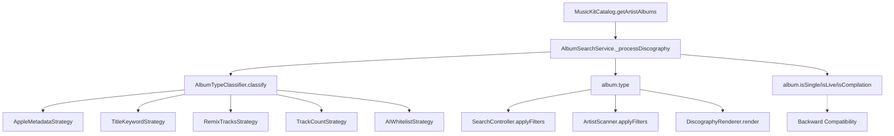

# ARCH-18: Album Classification Modularization (v4 - Funnel Refinado)

**Sprint**: 17.75
**Updated**: 2026-01-06 16:16
**Status**: 📋 PLANNING

---

## Funil de Classificação (5 Etapas)

```
                    ┌─────────────────────┐
                    │   ALL RELEASES      │
                    └─────────┬───────────┘
                              │
              ┌───────────────▼───────────────┐
              │  ETAPA 1: Apple Metadata      │  ← Fonte PRIMÁRIA inicial
              │  (isSingle, isCompilation)    │
              └───────────────┬───────────────┘
                              │ (não classificado explicitamente)
              ┌───────────────▼───────────────┐
              │  ETAPA 2: Title Keywords      │  ← Patterns no título
              │  (Live, DJ Mix, Remix, etc)   │
              └───────────────┬───────────────┘
                              │ (sem match de keyword)
              ┌───────────────▼───────────────┐
              │  ETAPA 3: Remix Tracks Check  │  ← Detecta singles com remixes
              │  (tracks com "remix" no nome) │
              └───────────────┬───────────────┘
                              │ (não é remix package)
              ┌───────────────▼───────────────┐
              │  ETAPA 4: Track Count + Dur   │  ← Com proteção prog rock
              │  (1-3: Single, 4-6: EP)       │
              └───────────────┬───────────────┘
                              │ (7+ tracks restantes)
              ┌───────────────▼───────────────┐
              │  ETAPA 5: AI Whitelist        │  ← Só eletrônica
              │  (Studio = AI confirmado)     │
              └───────────────┬───────────────┘
                              │ (não confirmado)
              ┌───────────────▼───────────────┐
              │     UNCATEGORIZED             │
              └───────────────────────────────┘
```

---

## Filtros UI

```
[Studio (X)] [Singles/EP (Y)] [Compilations (Z)] [Live (W)] [Uncategorized (N)]
```

---

## ETAPA 1: AppleMetadataStrategy (FONTE PRIMÁRIA INICIAL)

**Objetivo**: Usar flags oficiais da Apple Music API como fonte **primária e inicial** de classificação.

| Condição | Classificação |
|:---------|:--------------|
| `attributes.isSingle === true` | **Single** |
| `attributes.isCompilation === true` | **Compilation** |
| Nenhum flag → **Passa para próxima etapa** | |

---

## ETAPA 2: TitleKeywordStrategy

**Objetivo**: Classificar por patterns explícitos no título.

| Categoria | Patterns |
|:----------|:---------|
| **LIVE** | `(live)`, `live at`, `live from`, `unplugged`, `in concert`, `tour edition` |
| **DJ MIX** → Compilation | `(dj mix)`, `mixed by`, `continuous mix`, `megamix`, `ministry of sound`, regex: `(group therapy\|asot)\s*\d+` |
| **SINGLE** (explícito) | `- single`, `(single)`, `[single]` |
| **EP** (explícito) | `- ep`, `(ep)`, `[ep]` |
| **REMIX ALBUM** → Compilation | `remixes`, `remixed`, `the remixes` |
| **GREATEST HITS** → Compilation | `best of`, `greatest hits`, `anthology`, `essential` |
| **SOUNDTRACK** → Compilation | `soundtrack`, `ost`, `motion picture` |

---

## ETAPA 3: RemixTracksStrategy

**Objetivo**: Detectar singles/EPs com múltiplos remixes analisando os **nomes das tracks**.

### Heurística

```
SE (número de tracks com "remix", "mix", "version", "edit" no título >= 50% do total):
    SE (trackCount <= 6):
        → SINGLE
    SENÃO:
        → EP (remix package)
```

### Exemplos

| Release | Tracks | Track Titles | Resultado |
|:--------|:-------|:-------------|:----------|
| Connect | 15 | "Connect", "Connect (Extended Mix)", "Connect (Club Mix)", "Connect (Radio Edit)", ... | 80% remixes → **EP** |
| Blueprint | 12 | "Venera", "Piece of You", "Trust", ... (títulos únicos) | 0% remixes → **Passa** |

---

## ETAPA 4: TrackCountStrategy (COM PROTEÇÃO PROG ROCK)

**Objetivo**: Classificar por contagem de tracks **E duração** (protegendo álbuns com poucos tracks longos).

### Regras

| Condição | Classificação |
|:---------|:--------------|
| 1-3 tracks **E** duração total < 20 min | **Single** |
| 4-6 tracks **E** duração total < 30 min | **EP** |
| **Prog Rock/Art Rock** + duração >= 35 min + 3+ tracks | **Passa para próxima** (não é EP) |
| 7+ tracks | **Passa para próxima** |

### Proteção Prog Rock

Gêneros protegidos: `progressive rock`, `art rock`, `prog rock`, `progressive metal`, `post-rock`, `krautrock`

**Exemplo**: Yes - "Close to the Edge" (3 tracks, 38 min) → NÃO é EP, passa para próxima etapa.

---

## ETAPA 5: AIWhitelistStrategy (APENAS ELETRÔNICA)

**Objetivo**: Para releases de música eletrônica que chegaram até aqui (7+ tracks), usar AI como última confirmação.

### Aplicação

| Gênero | Comportamento |
|:-------|:--------------|
| **Eletrônica** (house, techno, trance, etc.) | AI whitelist decide: match → **Studio**, senão → **Uncategorized** |
| **Pop/Rock/Jazz/Classical tradicional** | 7+ tracks = **Studio Album** (sem AI, classificação direta) |

---

## 🔮 FUTURE ENHANCEMENT: EraCheckStrategy

> [!NOTE]
> **REMOVIDO DO ESCOPO ATUAL** - Requer pesquisa aprofundada antes de implementar.

### Contexto

Releases anteriores a ~1965 (era pré-LP) e 1965-1970 (era de transição) podem ter classificação ambígua. Artistas como James Brown, Stevie Wonder, Beatles iniciais lançavam principalmente singles.

### Considerações para Pesquisa Futura

- Quando exatamente o formato "álbum" se tornou padrão para cada gênero?
- Álbuns clássicos como Miles Davis "Kind of Blue" (1959), Beatles "Sgt. Pepper's" (1967) devem ser protegidos
- Gêneros como Jazz e Classical têm história diferente de Rock/Pop
- Precisamos de dados concretos antes de criar heurísticas

### Status
**Backlog**: Será pesquisado e implementado em sprint futuro após coleta de dados históricos.

---

## Gêneros Eletrônicos (Lista Expandida)

```javascript
const ELECTRONIC_GENRES = [
    // Main
    'electronic', 'electronica', 'dance', 'edm',
    
    // House (12 subgêneros)
    'house', 'deep house', 'progressive house', 'tech house', 
    'electro house', 'acid house', 'chicago house', 'disco house', 
    'funky house', 'latin house', 'tribal house', 'afro house',
    
    // Techno (5)
    'techno', 'detroit techno', 'minimal techno', 'melodic techno', 'industrial techno',
    
    // Trance (6)
    'trance', 'progressive trance', 'uplifting trance', 'vocal trance', 
    'psytrance', 'goa trance',
    
    // Other
    'dubstep', 'drum and bass', 'jungle', 'breakbeat',
    'ambient', 'downtempo', 'chillout', 'lounge',
    'uk garage', 'synthwave', 'synthpop', 'idm',
    'big room', 'future bass', 'bass music'
];
```

---

## Ferrry Corsten: Álbuns de Estúdio (6)

| Álbum | Ano | Tracks |
|:------|:----|:-------|
| Right of Way | 2003 | 12 |
| L.E.F. | 2006 | 12 |
| Twice in a Blue Moon | 2008 | 12 |
| WKND | 2012 | 12 |
| Blueprint | 2017 | 13 |
| Connect | 2024 | 12 |

**NÃO são álbuns de estúdio**: Once Upon a Night, Full On Ferry (compilações)

---

## Critérios de Sucesso

| ID | Critério |
|:---|:---------|
| SC-001 | Filtro Studio (eletrônica) = APENAS AI whitelisted |
| SC-002 | Filtro Studio (rock/pop) = 7+ tracks automaticamente |
| SC-003 | Singles com remixes detectados pelo RemixTracksStrategy |
| SC-004 | Yes - Close to the Edge NÃO classificado como EP |
| SC-005 | Pre-1965 releases vão para Uncategorized |
| SC-006 | Contadores visíveis em cada filtro |

---

## Arquitetura e Padrões de Design

### Alinhamento com a Constituição do Projeto

Esta implementação segue os princípios definidos em `docs/CONSTITUTION.md`:

| Princípio | Como é Aplicado |
|:----------|:----------------|
| **II. Clean Code & Modular Architecture** | Cada estratégia é um módulo independente com responsabilidade única |
| **Service Layer** | `AlbumTypeClassifier` é um serviço que encapsula a lógica de classificação |
| **Separation of Concerns** | Classificação separada de Search, Scoring, e Filtering |

---

### Padrões Arquiteturais Utilizados

#### 1. Chain of Responsibility (Funil)

O `AlbumTypeClassifier` implementa um **pipeline** onde cada estratégia processa o release e decide se classifica ou passa para a próxima etapa.

```javascript
// AlbumTypeClassifier.js - Orquestrador do Funil
export class AlbumTypeClassifier {
    constructor() {
        // Ordem das strategies = ordem do funil
        this.pipeline = [
            new AppleMetadataStrategy(),      // Etapa 1
            new TitleKeywordStrategy(),       // Etapa 2
            new RemixTracksStrategy(),        // Etapa 3
            new TrackCountStrategy(),         // Etapa 4
            new AIWhitelistStrategy()         // Etapa 5
        ];
    }

    classify(album, context) {
        for (const strategy of this.pipeline) {
            const result = strategy.execute(album, context);
            if (result !== null) {
                return result; // Classificado! Sai do funil
            }
            // result === null → passa para próxima
        }
        return 'Uncategorized'; // Nenhuma strategy classificou
    }
}
```

#### 2. Strategy Pattern (Estratégias Intercambiáveis)

Cada etapa do funil é uma **Strategy** que implementa a mesma interface:

```javascript
// classification/BaseStrategy.js
export class BaseStrategy {
    /** Nome para logging */
    name = 'BaseStrategy';
    
    /**
     * Tenta classificar o release
     * @param {Object} album - Dados do álbum
     * @param {Object} context - Contexto com AI list, gêneros, etc.
     * @returns {string|null} - Tipo classificado ou null para passar adiante
     */
    execute(album, context) {
        throw new Error('Subclass must implement execute()');
    }
}
```

**Benefícios**:
- Adicionar nova estratégia = criar novo arquivo, registrar no pipeline
- Remover estratégia = remover do pipeline
- Reordenar = mudar ordem no array
- Testar = mock album + context, verificar output

#### 3. Barrel Exports (Index.js)

Seguindo o padrão já usado em `views/*/index.js`:

```javascript
// classification/index.js
export { AppleMetadataStrategy } from './AppleMetadataStrategy.js';
export { TitleKeywordStrategy } from './TitleKeywordStrategy.js';
export { RemixTracksStrategy } from './RemixTracksStrategy.js';
export { TrackCountStrategy } from './TrackCountStrategy.js';
export { AIWhitelistStrategy } from './AIWhitelistStrategy.js';
export { ElectronicGenreDetector } from './ElectronicGenreDetector.js';
```

---

### Estrutura de Arquivos

```
public/js/services/album-search/
├── AlbumSearchService.js         # Existente - delega para AlbumTypeClassifier
├── AlbumTypeClassifier.js        # 🆕 Orquestrador do funil
├── ArtistNormalizer.js           # Existente
├── ScoreCalculator.js            # Existente
├── EditionFilter.js              # Existente
└── classification/               # 🆕 Pasta com estratégias
    ├── index.js                  # Barrel export
    ├── BaseStrategy.js           # Interface base
    ├── AppleMetadataStrategy.js  # Etapa 1
    ├── TitleKeywordStrategy.js   # Etapa 2
    ├── RemixTracksStrategy.js    # Etapa 3
    ├── TrackCountStrategy.js     # Etapa 4
    ├── AIWhitelistStrategy.js    # Etapa 5
    └── ElectronicGenreDetector.js # Helper compartilhado
```

---

### Integração com AlbumSearchService

O `AlbumSearchService` atualmente tem o método `_classifyWithAI()` inline. Após refatoração:

```javascript
// AlbumSearchService.js (ANTES)
class AlbumSearchService {
    _classifyWithAI(album, aiList) {
        // ~100 linhas de lógica inline 😱
    }
}

// AlbumSearchService.js (DEPOIS)
import { albumTypeClassifier } from './AlbumTypeClassifier.js';

class AlbumSearchService {
    _processDiscography(albums, aiList = []) {
        const context = { aiList }; // Contexto compartilhado
        
        return albums.map(album => ({
            ...album,
            type: albumTypeClassifier.classify(album, context),
            // ...
        }));
    }
    
    // _classifyWithAI() REMOVIDO - toda lógica agora em strategies
}
```

---

### Testabilidade

Cada strategy pode ser testada isoladamente:

```javascript
// __tests__/TitleKeywordStrategy.test.js
import { TitleKeywordStrategy } from '../classification/TitleKeywordStrategy.js';

describe('TitleKeywordStrategy', () => {
    const strategy = new TitleKeywordStrategy();

    test('classifica live albums', () => {
        const album = { title: 'Live at Madison Square Garden' };
        expect(strategy.execute(album, {})).toBe('Live');
    });

    test('passa adiante se não encontrar keyword', () => {
        const album = { title: 'Blueprint' };
        expect(strategy.execute(album, {})).toBeNull();
    });
});
```

---

### Extensibilidade Futura

Para adicionar `EraCheckStrategy` futuramente:

1. Criar `classification/EraCheckStrategy.js`
2. Registrar no pipeline em `AlbumTypeClassifier.js`:
   ```javascript
   this.pipeline = [
       new AppleMetadataStrategy(),
       new TitleKeywordStrategy(),
       new RemixTracksStrategy(),
       new TrackCountStrategy(),
       new EraCheckStrategy(),     // 🆕 Inserir aqui
       new AIWhitelistStrategy()
   ];
   ```
3. Nenhum outro arquivo precisa mudar!

---

## Arquivos a Implementar

| Arquivo | LOC | Responsabilidade |
|:--------|:----|:-----------------|
| `AlbumTypeClassifier.js` | ~80 | Orquestrador do funil, context builder |
| `classification/BaseStrategy.js` | ~15 | Interface abstrata para strategies |
| `classification/AppleMetadataStrategy.js` | ~25 | Etapa 1: isSingle, isCompilation |
| `classification/TitleKeywordStrategy.js` | ~90 | Etapa 2: Live, DJ Mix, Single, EP, Remix, Greatest Hits |
| `classification/RemixTracksStrategy.js` | ~45 | Etapa 3: Analisa nomes de tracks |
| `classification/TrackCountStrategy.js` | ~55 | Etapa 4: Track count + duração + prog rock |
| `classification/AIWhitelistStrategy.js` | ~50 | Etapa 5: AI para eletrônica |
| `classification/ElectronicGenreDetector.js` | ~40 | Helper: lista de gêneros eletrônicos |
| `classification/index.js` | ~10 | Barrel export |

**Total**: ~410 LOC novos, ~100 LOC removidos de `AlbumSearchService.js`

---

## 🍎 Apple Music API: Atributos de Álbum para Classificação

> [!IMPORTANT]
> **DESCOBERTA (2026-01-06)**: A Apple Music API fornece atributos nativos que **não estavam sendo utilizados** no projeto. Esta seção documenta todos os atributos disponíveis para referência retroativa.

### Atributos Booleanos Nativos

| Atributo | Tipo | Descrição | Status no Projeto |
|:---------|:-----|:----------|:------------------|
| `isSingle` | `boolean` | Indica se consiste de uma única música | ✅ Usado na Etapa 1 |
| `isCompilation` | `boolean` | Indica se é uma coletânea | ✅ Usado na Etapa 1 |
| `isComplete` | `boolean` | Se todas as faixas estão disponíveis na região | ❌ Não usado |
| `isMasteredForItunes` | `boolean` | Se foi masterizado para Apple Digital Master | ❌ Não relevante |

### Atributos de Tipagem Nativa (NÃO UTILIZADOS)

| Atributo | Tipo | Valores Possíveis | Status |
|:---------|:-----|:------------------|:-------|
| `albumType` | `string` | `standard`, `single`, `deluxe`, `compilation`, **`ep`** | ⚠️ **NÃO USADO** - API fornece EP nativamente! |
| `contentTraits` | `string[]` | Array que pode incluir `live` | ⚠️ **NÃO USADO** - API pode indicar Live! |

### Outros Atributos Úteis

| Atributo | Tipo | Uso Potencial |
|:---------|:-----|:--------------|
| `trackCount` | `number` | ✅ Usado na Etapa 4 (TrackCountStrategy) |
| `genreNames` | `string[]` | ✅ Usado para detectar música eletrônica |
| `releaseDate` | `string` | Pode ajudar EraCheckStrategy futuro |
| `recordLabel` | `string` | Não usado atualmente |
| `audioVariants` | `string[]` | `dolby-atmos`, `hi-res-lossless`, etc. - Não relevante |

### Atributos Estendidos (Requerem `extend` parameter)

- `artistUrl` - URL do artista
- `audioVariants` - Qualidade de áudio disponível

### Recomendação

A `AppleMetadataStrategy` (Etapa 1) deve ser estendida para verificar:

```javascript
// PROPOSTA: AppleMetadataStrategy melhorada
execute(album, context) {
    const attrs = album.raw?.attributes || album;
    
    // 1. Check native albumType (NOVO!)
    if (attrs.albumType === 'ep') return 'EP';
    if (attrs.albumType === 'single') return 'Single';
    if (attrs.albumType === 'compilation') return 'Compilation';
    
    // 2. Check contentTraits for Live (NOVO!)
    if (attrs.contentTraits?.includes('live')) return 'Live';
    
    // 3. Fallback to boolean flags (existente)
    if (attrs.isSingle === true) return 'Single';
    if (attrs.isCompilation === true) return 'Compilation';
    
    return null;
}
```

---

## 🔍 Análise de Impacto Holístico: Unificação da Classificação

> [!CAUTION]
> **DESCOBERTA (2026-01-06)**: Existem **7 arquivos** com lógica de classificação duplicada/dispersa que precisam ser unificados para usar `album.type` do ARCH-18.

### Arquivos com Lógica de Classificação

| Arquivo | Linhas | Problema | Ação Necessária |
|:--------|:-------|:---------|:----------------|
| `MusicKitCatalog.js` | 274-281 | `_classifyAlbumType()` duplica lógica | **REMOVER** - centralizar no ARCH-18 |
| `ArtistScanner.js` | 159-169 | Lógica inline duplicada usando `albumType` | **REFATORAR** - usar `album.type` |
| `DiscographyRenderer.js` | 37-39 | Usa `isLive`, `isSingle`, `isCompilation` | **REFATORAR** - usar `album.type` |
| `PlaylistsExport.js` | 158 | `isLiveAlbum` baseado em título | Avaliar se precisa mudança |
| `EditionFilter.js` | 47, 51 | `isLive()`, `isCompilation()` methods | Avaliar se são necessários |
| `ScoreCalculator.js` | 48-61 | `_isLive()` para penalidades | Manter - contexto diferente (scoring) |
| `AlbumSearchService.js` | 140-142 | Cria flags `isSingle`, `isCompilation`, `isLive` | ✅ Correto - backward compatibility |

### Fluxo Atual de Dados

```
┌─────────────────────────┐     ┌───────────────────────────┐
│  MusicKitCatalog.js     │     │  AlbumSearchService.js    │
│  getArtistAlbums()      │     │  _processDiscography()    │
├─────────────────────────┤     ├───────────────────────────┤
│  _classifyAlbumType() → │     │  AlbumTypeClassifier →    │
│  album.albumType        │     │  album.type               │
│  (classificação básica) │     │  (classificação completa) │
└─────────────────────────┘     └───────────────────────────┘
          │                                 │
          │ DUPLICAÇÃO!                     │
          │                                 │
          ▼                                 ▼
┌─────────────────────────────────────────────────────────┐
│               Consumidores                               │
├─────────────────────────────────────────────────────────┤
│  ArtistScanner.js     usa album.albumType ❌            │
│  SearchController.js  usa album.type ✅ (ARCH-18)       │
│  DiscographyRenderer  usa album.isLive, etc. ⚠️         │
└─────────────────────────────────────────────────────────┘
```

### Fluxo Proposto (Unificado)

```
┌─────────────────────────┐
│  MusicKitCatalog.js     │
│  getArtistAlbums()      │
├─────────────────────────┤
│  Passa raw data →       │ ← NÃO classifica mais
│  album.raw.attributes   │
└─────────────────────────┘
          │
          ▼
┌───────────────────────────────┐
│  AlbumSearchService.js        │
│  _processDiscography()        │
├───────────────────────────────┤
│  AlbumTypeClassifier.classify │ ← Única fonte de classificação
│  album.type (Single Source)   │
│  album.isSingle (compat)      │
│  album.isLive (compat)        │
│  album.isCompilation (compat) │
└───────────────────────────────┘
          │
          ▼
┌─────────────────────────────────────────────────────────┐
│               Consumidores (Unificados)                  │
├─────────────────────────────────────────────────────────┤
│  ArtistScanner.js     usa album.type ✅                 │
│  SearchController.js  usa album.type ✅                 │
│  DiscographyRenderer  usa album.type ✅                 │
└─────────────────────────────────────────────────────────┘
```

### Gráfico de Dependência



---

## Sprint 17.75-B: Tarefas de Unificação (PROPOSTA)

> [!WARNING]
> **ESCOPO ADICIONAL**: Para completar a arquitetura limpa, os seguintes arquivos precisam ser refatorados.

### Fase A: Remover Duplicação

1. **`MusicKitCatalog.js`**
   - Remover `_classifyAlbumType()` (linhas 274-281)
   - Remover `albumType: this._classifyAlbumType()` (linha 185)
   - Manter `raw: album` para passar dados à classificação

2. **`ArtistScanner.js`**
   - Refatorar `applyFilters()` (linhas 154-170)
   - Usar `album.type` em vez de `album.albumType`
   - Adicionar suporte a EP e Uncategorized filters

3. **`DiscographyRenderer.js`**
   - Refatorar `getBadges()` (linhas 37-39)
   - Usar `album.type` para determinar badges

### Fase B: Melhorar AppleMetadataStrategy

4. **`AppleMetadataStrategy.js`**
   - Adicionar verificação de `albumType` nativo (ep, single, compilation)
   - Adicionar verificação de `contentTraits` para Live
   - Manter fallback para `isSingle`/`isCompilation` booleans

### Verificação

- Testar Ferry Corsten: 8 Studio, 31 EPs, 105 Singles, 1 Live, 186 Compilations
- Testar Yes: "Close to the Edge" não deve ser EP
- Verificar `ArtistScanner` na view de Series mostra contagens corretas

