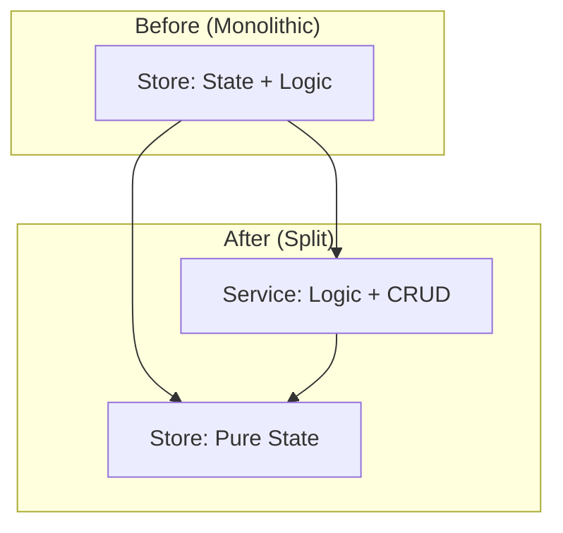

# Implementation Plan - Sprint 19 Track B: Stores Refactoring
**Status**: 📋 PENDING REVIEW
**Agent**: Agent 2 (Stores Specialist)
**Branch**: `feature/sprint-19-track-b-stores`

---

## Goal
Split `playlists.js` and `albumSeries.js` stores into pure state containers + service classes to achieve < 250 LOC per store.

## Proposed Changes

### 1. Playlists Store Refactoring

#### [NEW] `services/PlaylistsService.js`
**Responsibility**: Handle computation, CRUD orchestration, and complex operations.

**Public API**:
```javascript
class PlaylistsService {
    // CRUD Orchestration
    async saveBatch(name, playlists) → Promise<void>
    async loadBatch(seriesId, batchName) → Promise<Playlist[]>
    async deleteBatch(seriesId, batchName) → Promise<void>
    
    // Computation
    calculateStats(playlists) → { totalTracks, totalDuration }
    filterByAlgorithm(playlists, algorithm) → Playlist[]
    
    // Export Helpers
    prepareForExport(playlist) → ExportPayload
}
```

#### [MODIFY] `stores/playlists.js`
- Remove computation methods (move to Service).
- Keep only state management: `playlists`, `currentBatch`, `isLoading`.
- Expose simple setters: `setPlaylists()`, `addPlaylist()`, `removePlaylist()`.

---

### 2. AlbumSeries Store Refactoring

#### [NEW] `services/SeriesService.js`
**Responsibility**: Handle series CRUD, enrichment orchestration, and album management.

**Public API**:
```javascript
class SeriesService {
    // CRUD
    async createSeries(name, albumQueries) → Promise<Series>
    async updateSeries(id, updates) → Promise<void>
    async deleteSeries(id) → Promise<void>
    
    // Album Management
    async addAlbumToSeries(seriesId, album) → Promise<void>
    async removeAlbumFromSeries(seriesId, albumId) → Promise<void>
    
    // Enrichment Orchestration
    async enrichAllAlbums(seriesId, onProgress) → Promise<void>
}
```

#### [MODIFY] `stores/albumSeries.js`
- Remove CRUD logic (move to Service).
- Keep only state management: `series[]`, `activeSeries`, `isLoading`.
- Expose simple setters: `setSeries()`, `setActiveSeries()`.

---

## Logic Flow



---

## Interface Contract

> **CRITICAL**: Views (Track A) will import these Services. Agree on API before starting.

| Service | Method | Params | Returns |
|:--------|:-------|:-------|:--------|
| `PlaylistsService` | `saveBatch` | `name, playlists` | `Promise<void>` |
| `PlaylistsService` | `calculateStats` | `playlists` | `{ totalTracks, totalDuration }` |
| `SeriesService` | `createSeries` | `name, albumQueries` | `Promise<Series>` |
| `SeriesService` | `enrichAllAlbums` | `seriesId, onProgress` | `Promise<void>` |

---

## Verification Plan

1. **Build**: `npm run build` must pass.
2. **Browser Regression**: Run `[PLAYLIST_MGR]` and `[BLEND]` checklists via Agent Browser.
3. **LOC Check**: `playlists.js` < 250, `albumSeries.js` < 250.
4. **Unit Tests**: Ensure existing tests pass (if any).

---

## Merge Order

**Track B merges FIRST** to `main` so Track A can consume the new Services.

---

## Files Owned (Do Not Touch Track A Files)
- `public/js/stores/playlists.js`
- `public/js/stores/albumSeries.js`
- `public/js/services/PlaylistsService.js` (NEW)
- `public/js/services/SeriesService.js` (NEW)
