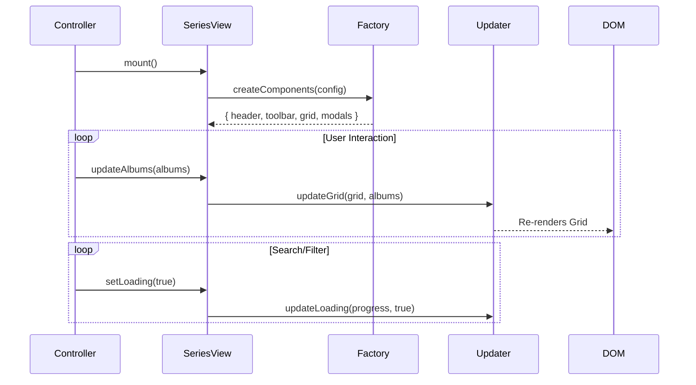

# Implementation Plan - Sprint 19 Track E: SeriesView Final Refinement

**Status**: 📋 PENDING REVIEW
**Agent**: Antigravity
**Branch**: `feature/sprint-19-tracks`

## Goal
Reduce `SeriesView.js` to < 200 LOC by implementing a strictly separated "Factory + Updater" architecture. Use the existing "Thin View" pattern to delegate all DOM/Component logic.

---

## 1. Architectural Changes

### The Pattern: Thin Shell
The `SeriesView` class will only:
1.  **Initialize** the Controller, Factory, and Updater.
2.  **Mount**: Delegate to Factory.
3.  **Update**: Delegate to Updater.
4.  **Destroy**: Delegate cleanup.

### Class Separation

#### A. `SeriesComponentFactory.js` (The Builder)
*   **Responsibility**: One-time setup of DOM elements and Component instantiation.
*   **Methods**:
    *   `createHeader({ props })`: Returns component instance.
    *   `createToolbar({ props })`: Returns component instance.
    *   `createGrid({ props })`: Returns component instance.
*   **Note**: This replaces `SeriesViewMounter.js`.

#### B. `SeriesViewUpdater.js` (The Painter)
*   **Responsibility**: Reflecting state changes onto the already-mounted components.
*   **Methods**:
    *   `updateAll(components, state)`
    *   `updateHeader(header, state)`
    *   `updateLoading(inlineProgress, isLoading)`
    *   `updateEmptyState(container, count)`

---

## 2. Logic Flow

---

## 3. File Structure Changes

| File | Action | Description |
|:-----|:-------|:------------|
| `public/js/views/SeriesView.js` | **MODIFY** | Strip all `mount*` and `update*` methods. |
| `public/js/views/helpers/SeriesComponentFactory.js` | **NEW** | Replaces `SeriesViewMounter`. |
| `public/js/views/helpers/SeriesViewUpdater.js` | **NEW** | Handles updates. |
| `public/js/views/helpers/SeriesModalsManager.js` | **MODIFY** | Ensure self-contained event wiring. |
| `public/js/views/helpers/SeriesViewMounter.js` | **DELETE** | Replaced by Factory. |

---

## 4. Verification Plan

### Automated
*   **Build**: `npm run build` must pass.
*   **Unit Tests**: Not available for Views currently.

### Manual Regression (`[SERIES]`)
1.  **Navigation**: Home -> Series -> Single Series.
2.  **Interaction**: Search "Led Zeppelin", Filter "Vinyl".
3.  **Modals**: Open "Edit Series", "Delete Series".
4.  **Responsiveness**: Toggle Grid/List view.
