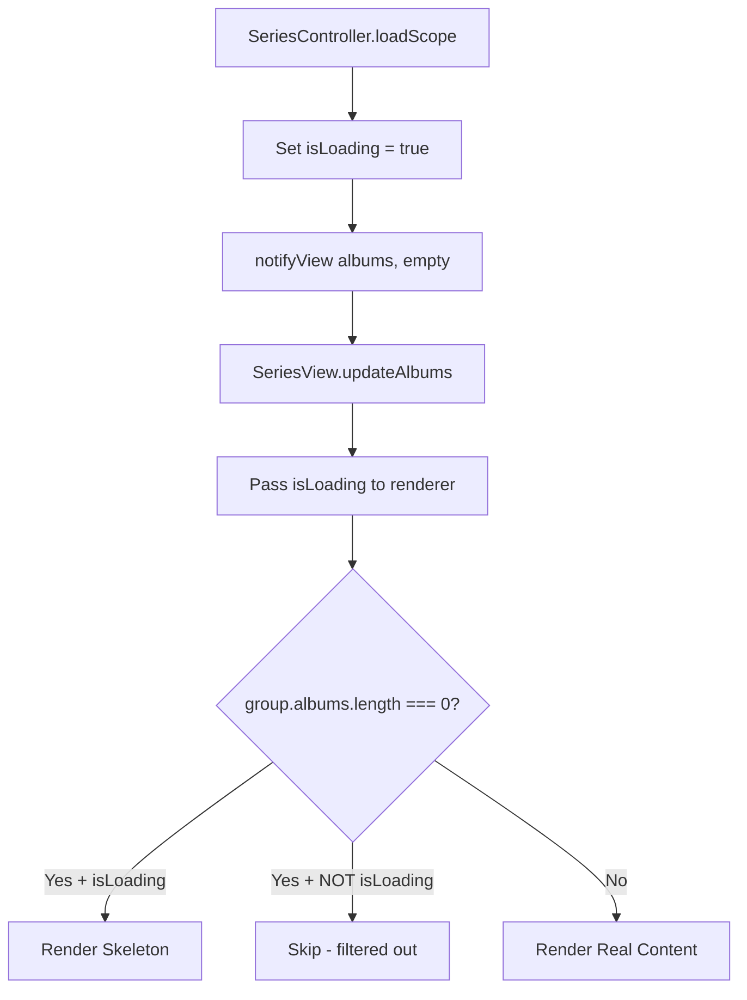

# Sprint 21.5 Bug Fixing - Implementation Plan

## SDD Phase 2: Plan

**Sprint**: 21.5 Bug Fixing  
**Status**: DRAFT - Awaiting Review  
**Date**: 2026-01-15

---

## Documentation Consulted

| Manual | Information Used |
|--------|-----------------|
| `00_Dir_File_Structure_Map.md` | File locations for all affected components (#192 SeriesService, #197 SeriesProgressBar, #143 SeriesController) |
| `00_MJRP_Album_Blender_Ref_Guide_Index.md` | Reference guide navigation |
| `01_System_Architecture.md` | MVC pattern, Observer pattern, Service Layer pattern |
| `09_Frontend_Views.md` | SeriesView as "Thin Orchestrator", helper pattern |
| `17_Frontend_Services.md` | SeriesService cache behavior |
| `CONSTITUTION.md` | User-Centric Quality, Clean Code principles |

---

## Implementation Order

```
#154 (Data) → #156/#158 (Cache) → #155 (Navigation) → #153 (View) → #152/#152B (Skeleton)
```

---

## Issue #154: Album Deletion Match Error

### Architecture
```
HomeController.createSeriesWithAlbum() → SeriesService.createSeries()
                                        ↓
                                 Expects { title: ... }
                                        ↓
                                 Got { album: ... } ❌
```

### Files to Modify
| File | Change |
|------|--------|
| `public/js/controllers/HomeController.js` | Fix data mapping: `album` → `title` |
| `public/js/services/SeriesService.js` | Add fallback: `query.title \|\| query.album` |

---

## Issue #156 & #158: Cache Invalidation

### Architecture
```
SeriesService.createSeries() → DB Updated ✅
                             → Cache NOT Invalidated ❌
                                   ↓
                             Old data returned on refresh
```

### Files to Modify
| File | Change |
|------|--------|
| `public/js/services/SeriesService.js` | Add `this.cache.clearAlbumSeries('ALL_SERIES_VIEW')` to: `createSeries()`, `updateSeries()`, `removeAlbumFromSeries()`, `deleteSeries()` |

---

## Issue #155: Series Deletion Freeze

### Architecture
```
SeriesModalsManager.handleSeriesDeleted() → Cache Cleared ✅
                                          → Navigation NOT Forced ❌
                                                ↓
                                          App stuck on deleted view
```

### Files to Modify
| File | Change |
|------|--------|
| `public/js/views/helpers/SeriesModalsManager.js` | Force navigation after delete: `router.navigate('/albums')` |

---

## Issue #153: Series Edit Double Toast

### Architecture
```
SeriesEditModal.onSave() → SeriesModalsManager.handleSeriesUpdated()
                                      ↓
                         updateHeader(undefined) ❌ → TypeError
                                      ↓
                         Catch block triggers failure toast
```

### Files to Modify
| File | Change |
|------|--------|
| `public/js/views/helpers/SeriesModalsManager.js` | Add null check before `updateHeader()` |
| `public/js/views/helpers/SeriesViewUpdater.js` | Add defensive check in `updateHeaderPayload()` |

---

## Issue #152: Ghost Skeletons

### Architecture
```
SeriesController.loadScope() → notifyView('albums', [])
                                      ↓
                         SeriesView.updateAlbums([])
                                      ↓
                         SeriesGridRenderer.render()
                                      ↓
                         if (albums.length === 0) return; ← HIDES skeleton
```

### Logic Flow (Fixed)


### Files to Modify
| File | Change |
|------|--------|
| `public/js/controllers/SeriesController.js` | Pass `isLoading` state to view |
| `public/js/views/SeriesView.js` | Pass `isLoading` to updater |
| `public/js/views/helpers/SeriesViewUpdater.js` | Pass `isLoading` to grid |
| `public/js/components/series/SeriesGridRenderer.js` | Distinguish loading vs filtered: `if (empty && isLoading) → skeleton; if (empty && !isLoading) → skip` |

---

## Issue #152B: Progress Bar Cleanup

### Files to Modify
| File | Action |
|------|--------|
| `public/js/components/series/SeriesProgressBar.js` | **DELETE** |
| `public/js/views/SeriesView.js` | Remove progress bar mount/unmount |
| `public/js/views/helpers/SeriesViewUpdater.js` | Remove `inlineProgress` component |
| `public/js/views/helpers/SeriesComponentFactory.js` | Remove progress bar creation |
| `public/js/controllers/SeriesController.js` | Remove `notifyView('progress', ...)` calls |
| `docs/manual/09_Frontend_Views.md` | Update: remove `SeriesProgressBar` reference |
| `docs/manual/00_Dir_File_Structure_Map.md` | Update: remove #197 SeriesProgressBar |

### Files to PRESERVE
- `public/js/components/InlineProgress.js` (reusable)
- `public/js/components/GlobalProgress.js` (reusable)

---

## Verification Plan

### Automated
```bash
npm run test          # Unit tests
npm run build         # Build verification
```

### Manual Testing
| Issue | Test |
|-------|------|
| #154 | Delete album from series → No error |
| #156 | Create series → Appears immediately |
| #158 | Delete series → Other series intact |
| #155 | Delete series → App responsive |
| #153 | Edit series → Single toast |
| #152 | Load All Series → Skeletons visible |
| #152B | No progress bar in Series views |

---

## Approval

- [ ] User Review
- [ ] Approved to proceed to TASK phase

---

**Gate**: Cannot proceed to `tasks.md` until this plan is APPROVED.
