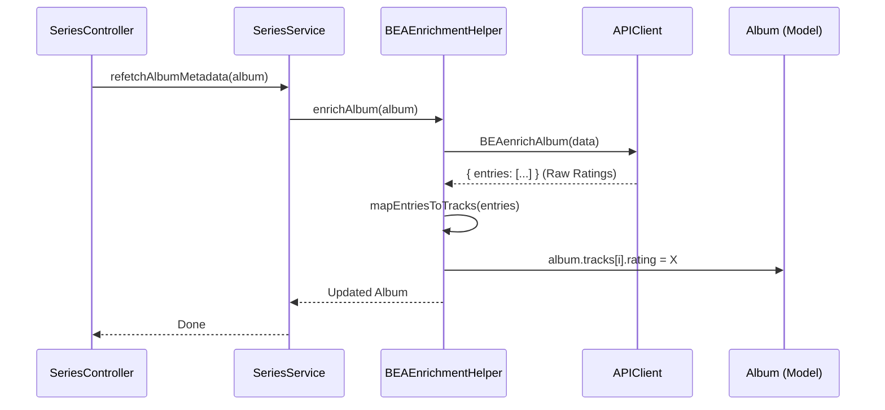

# Plan: Sprint 22 - Enrichment & Filters
> **Based on Spec**: [spec.md](./spec.md)
> **Manuals Consulted**:
> - `00_MJRP_Album_Blender_Ref_Guide_Index.md` (Index)
> - `01_System_Architecture.md` (Core Principles)
> - `09_Frontend_Views.md` (Component Structure)
> - `17_Frontend_Services.md` (Service Patterns)

## 1. Architecture Design

### 1.1 Generic Filter Engine
We will move away from the "Hardcoded Filter Service" pattern to a **Generic Engine** pattern to allow reuse without duplication.

```mermaid
classDiagram
    class FilterUtils {
        +normalizeString(str)
        +textMatch(item, fields, query)
        +dateSort(itemA, itemB, field, dir)
    }

    class GenericFilterEngine {
        +filter(items, config, criteria)
    }

    class SeriesFilterService {
        +filterAlbums(albums, criteria)
        (Adapts Album Model -> FilterUtils)
    }

    class SavedPlaylistsFilterService {
        +filterSeries(seriesList, criteria)
        (Adapts Series Model -> FilterUtils)
    }

    SeriesFilterService --> FilterUtils
    SavedPlaylistsFilterService --> FilterUtils
    GenericFilterEngine ..> FilterUtils
```

### 1.2 BEA Enrichment Helper
We will implement the **Helper/Store** pattern found in `SpotifyEnrichmentHelper.js` to Clean Architecture principles (Separation of Concerns).



---

## 2. UI/UX Design

### 2.1 Saved Playlists Filter Toolbar
We will refactor `SeriesToolbar` into a generic `FilterToolbar`.

**Mockup (Desktop):**
```text
[ Search... (🔍) ] [ All Series (⬇) ] [ All Batches (⬇) ] [ Sort: Updated (⬇) ]
```

**Filters:**
1.  **Search Input**: Filters by Series Name or Batch Name (Fuzzy).
2.  **Series Dropdown**: "All Series" vs Specific Series (Exact Match).
3.  **Batch Dropdown**: "All Batches" vs Specific Batch Name (Exact Match).
4.  **Sort Dropdown**:
    *   Recently Added/Updated (Default)
    *   Name (A-Z)
    *   Name (Z-A)

**UI Logic:**
*   **Series Dropdown** is populated by unique `series.name`.
*   **Batch Dropdown** is populated by unique `batch.name` (derived from flattening the list).


### 2.2 Component Hierarchy
```text
SavedPlaylistsView
├── TopNav
├── FilterToolbar (New Reusable Component)
│   ├── FilterSearchInput
│   └── FilterSortDropdown
└── SavedSeriesList (Grid)
    └── SavedSeriesGroup
```

---

## 3. Implementation Steps

### Phase 1: Filter Logic Core
1.  Create `public/js/utils/FilterUtils.js`.
2.  Create `public/js/services/SavedPlaylistsFilterService.js`.
3.  Unit Test the Utils.

### Phase 2: BEA Enrichment
1.  Create `public/js/helpers/BEAEnrichmentHelper.js`.
2.  Refactor `SeriesService.js` to use the helper.
3.  Clean up `APIClient.js`.

### Phase 3: UI Integration
1.  Refactor `SavedPlaylistsView.js` to include the Toolbar.
2.  Wire up the Controller to handle `onFilterChange` and `onSortChange`.

## 4. Verification Strategy
*   **Zero Regression**: Compare `SeriesView` formatting/sorting before and after refactoring.
*   **New Feature**: Test "Search Series" with fuzzy terms.
*   **Enrichment**: Verify "BestEver" badge appears on a newly added album after "Refetch".
