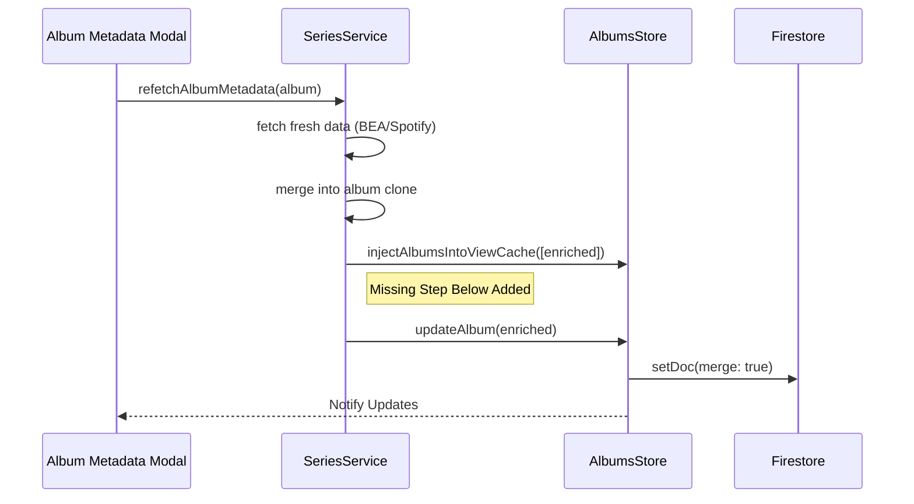

# Technical Plan: Sprint 23 - Consolidated Ranking Refactor [APPROVED]

> **[⬅️ Back to Reference Guide Index](../../../manual/00_MJRP_Album_Blender_Ref_Guide_Index.md)**

## 1. Goal
Implement the `rankingConsolidated` schema to preserve evidence provenance and fix the "Enrichment Persistence" bug.

## 2. Consulted Documentation
- `docs/manual/01_System_Architecture.md`: Confirmed **Strategy Pattern** usage and recommended **Service -> Store -> DB** flow.
- `docs/manual/18_Frontend_Logic_Core.md`: Confirmed `TrackTransformer` is the correct place for normalization.
- `docs/manual/16_Frontend_Components_Search_and_Ranking.md`: Confirmed `TracksTable.js` structure for UI updates.
- `docs/manual/04_Backend_Logic_Services.md`: Reviewed `fetchRanking` logic.

## 3. Architecture & Data Flow

### 3.1 Data Model Change
Moving from "Flattened" to "Consolidated" schema.

**Before (Current)**:
```javascript
// Track Object
{
  title: "Track A",
  rating: 88,              // Flattened (Lost Source)
  spotifyPopularity: 75    // Flattened
}
```

**After (Proposed)**:
```javascript
// Track Object
{
  title: "Track A",
  ranking: {
    evidence: [
      { source: 'BestEverAlbums', score: 90, votes: 400, url: '...' },
      { source: 'Spotify', score: 75, popularity: 75 }
    ],
    // Legacy support (calculated from evidence)
    rating: 90,
    spotifyPopularity: 75
  }
}
```

### 3.2 Persistence Logic Flow (Immediate Fix)
We need to close the loop between `SeriesService` and `AlbumsStore`.



## 4. UI Strategy (Mockups)

### 4.1 Evidence Tooltip
When hovering over the Rating Badge (Sprint 22.5 decoupled capability), we show detailed provenance.

```text
+-----------------------------------+
|  1. Track Title           ★ 90    | <--- Mouse Hover
+---------------------------^-------+
                            |
           +----------------+------------------+
           | 🏆 BestEverAlbums: 90 (400 votes) |
           | 🎧 Spotify: 75 (Popularity)       |
           | --------------------------------- |
           | Winning Score: 90 (Acclaim)       |
           +-----------------------------------+
```

## 5. Implementation Strategy

### Phase 1: Persistence (Critical Fix)
1.  **Modify `SeriesService.js`**:
    - Locate `refetchAlbumMetadata`.
    - After `injectAlbumsIntoViewCache`, call `albumsStore.updateAlbum(enriched)`.
2.  **Verify `AlbumsStore.js`**:
    - Ensure `updateAlbum` calls `saveToFirestore`. (Confirmed in `01_System_Architecture` review: Repositories/Stores handle persistence).

### Phase 2: Ranking Refactor
1.  **Backend (`fetchRanking.js`)**:
    - Change `mergeRankingEvidence` to return `{ tracks: [{ evidence: [...] }] }`.
2.  **Transformer (`TrackTransformer.js`)**:
    - Map `evidence` to `track.ranking.evidence`.
    - **Backward Compat**: Calculate `track.rating` = `max(evidence.scores)`.
3.  **Strategies**:
    - Update `BalancedRankingStrategy` to read from `ranking.evidence`.

## 6. Risks & Mitigation
-   **Breaking Grid**: If `rating` is missing, the grid breaks. -> **Mitigation**: `TrackTransformer` will *guarantee* `rating` exists by calculating it from evidence.
-   **Database Bloat**: Storing full evidence increases doc size. -> **Mitigation**: Only store essential fields (source, score, votes).
