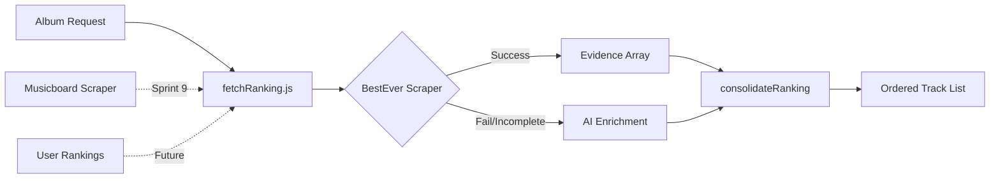

# Rankings System Architecture

**Created**: 2025-12-17
**Sprint**: 9 - Rankings Refactor & Data Enrichment

---

## 📊 Overview

The Rankings System consolidates track rankings from multiple sources to determine the order of tracks in playlists.



---

## 🏗️ Core Components

### 1. `server/lib/fetchRanking.js`

**Purpose**: Orchestrates ranking data fetching from multiple sources.

**Current Flow**:
1. Try BestEver scraper
2. If incomplete → AI enrichment (Gemini)
3. Merge results with album tracks

**Integration Points** (for Musicboard):
- Line 53-77: BestEver scraper block
- After BestEver, before AI enrichment

### 2. `server/lib/ranking.js`

**Purpose**: Consolidates rankings using Borda count algorithm.

**Key Function**: `consolidateRanking(tracks, acclaim)`
- `tracks`: Official album tracklist
- `acclaim`: Array of `{ provider, trackTitle, position, rating, referenceUrl }`

**Algorithm**:
- Borda points: `N - position + 1` (where N = total tracks)
- Rating priority: BestEver > Other sources
- Fuzzy matching: Token overlap >= 0.4

### 3. `server/lib/scrapers/besteveralbums.js`

**Purpose**: Scrape track ratings from BestEverAlbums.com

**Output Format**:
```javascript
{
  provider: 'BestEverAlbums',
  providerType: 'community',
  referenceUrl: 'https://...',
  evidence: [
    { trackTitle: 'Enter Sandman', rating: 94 },
    { trackTitle: 'Sad But True', rating: 91 }
  ]
}
```

### 4. `server/lib/scrapers/musicboard.js` (In Progress)

**Purpose**: Scrape track ratings from musicboard.app

**Status**: Skeleton created, needs DOM selector debugging

---

## 📈 Rating Scales

| Source | Scale | Normalization |
|--------|-------|---------------|
| BestEverAlbums | 0-100 | Use directly |
| Musicboard | 0-10 | Multiply by 10 |
| User Rankings | 1-N (position) | Convert to Borda points |

---

## 🔄 Data Flow

### Input: Album Request
```javascript
{
  title: "Metallica",
  artist: "Metallica",
  tracks: [
    { title: "Enter Sandman", duration: 331 },
    { title: "Sad But True", duration: 324 },
    // ...
  ]
}
```

### Output: Ranked Entries
```javascript
{
  entries: [
    { trackTitle: "Enter Sandman", position: 1, rating: 94, provider: "BestEverAlbums" },
    { trackTitle: "Sad But True", position: 2, rating: 91, provider: "BestEverAlbums" }
  ],
  sources: [
    { provider: "BestEverAlbums", providerType: "community", referenceUrl: "..." }
  ]
}
```

---

## 🎯 Source Priority (Sprint 9 Decision)

```
1. BestEverAlbums (primary - most complete data)
   ↓
2. Musicboard (secondary - when BestEver incomplete)
   ↓
3. User Rankings (future - manual override capability)
   ↓
4. AI Enrichment (fallback - when scrapers fail)
```

---

## 📝 Sprint 9 Changes Planned

### fetchRanking.js Modifications

```javascript
// BEFORE (current): Only BestEver
const best = await getBestEverRanking(title, artist)

// AFTER (Sprint 9): BestEver + Musicboard fallback
const best = await getBestEverRanking(title, artist)
if (!best || best.evidence?.length < minTracks) {
  const musicboard = await getMusicboardRanking(title, artist)
  // Merge sources, normalize ratings (Musicboard 0-10 → 0-100)
}
```

### Rating Normalization Helper

```javascript
function normalizeRating(rating, source) {
  if (source === 'Musicboard') {
    return rating * 10 // 0-10 → 0-100
  }
  return rating // BestEver already 0-100
}
```

---

## 🧪 Testing Considerations

1. **Multi-source consolidation**: Both BestEver + Musicboard evidence
2. **Rating normalization**: 0-10 → 0-100 conversion
3. **Fallback behavior**: Musicboard only when BestEver incomplete
4. **Fuzzy matching**: Track title variations across sources
