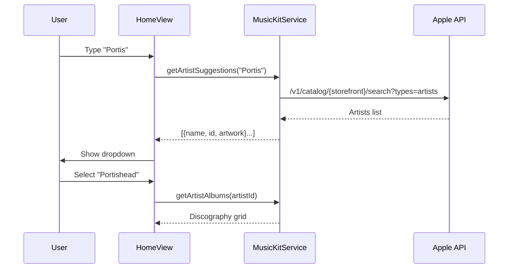

# Sprint 9 Planning: Rankings & Artist/Album Enrichment

## 📋 Overview

Sprint 9 focuses on two main areas:
1. **Rankings Integration** - Using track rankings in the playlist algorithms
2. **Artist/Album Enrichment** - Live search via Apple Music API vs internal batch

---

## 🔍 Analysis: Apple Music API Integration

### Current State
- **MusicKitService.js** already has:
  - `getArtistAlbums(artistName)` - Fetches discography from Apple Music
  - `searchAlbums(artist, album)` - Searches catalog
  - Rate: **20 requests/second** per user (generous)

### Question: Internal Batch vs Apple API Direct?

| Approach | Pros | Cons |
|----------|------|------|
| **Internal Batch** | Faster (local), No API limits, Works offline | Limited catalog, Manual updates |
| **Apple API Direct** | Complete catalog, Always current, No maintenance | Requires auth, Latency (~200-500ms), Rate limits |
| **Hybrid** | Best of both, Cache popular artists | More complexity |

### Recommendation: **Hybrid Approach**

1. **Artist Filter Dropdown**: 
   - Type-ahead uses Apple API (`getArtistAlbums`)
   - Results cached in memory for session
   - Performance: ~300ms for first search, instant thereafter

2. **Album Select**:
   - Already uses Apple API via `searchAlbums`
   - Performance acceptable (200-500ms)

3. **Fallback**:
   - If API fails, show "Bulk Mode" text input
   - Previously loaded artists remain in dropdown

### Performance Considerations

```
Apple Music API:
- First request: 200-500ms (cold)
- Subsequent: <200ms (likely cached by Apple CDN)
- Rate limit: 20 req/s = very generous
- Pagination: Up to 100 albums per request
```

**Verdict: API Direct is VIABLE** with proper caching strategy.

---

## 📊 Rankings System Analysis

### Current Implementation
- **consolidateRanking()** in `server/lib/ranking.js` uses Borda count
- **RankingView.js** displays ranked vs original tracklist
- Rankings come from external acclaim sources

### Sprint 9 Goals for Rankings
1. **UI to view/edit track rankings** per album
2. **Algorithm uses rankings** to prioritize tracks in playlists
3. **Manual override** capability for user preferences

---

## 🎯 Proposed Sprint 9 Scope

### Phase 1: Artist/Album Enrichment (Apple API Live)
- [ ] Add artist search autocomplete with Apple API
- [ ] Cache artist discographies in session
- [ ] Loading states and error handling
- [ ] Fallback to bulk mode on API failure

### Phase 2: Rankings Integration
- [ ] Rankings editor in album detail view
- [ ] Store rankings in Firestore per album
- [ ] Algorithm pulls rankings when generating playlists
- [ ] Visual indicator in playlist tracks (rank badge)

### Phase 3: UI Polish
- [ ] Artist dropdown with avatar/images
- [ ] Album cards with release year badges
- [ ] Ranking badges in track lists

---

## ⚙️ Technical Implementation Notes

### Artist Autocomplete Flow


### Rankings Data Model
```javascript
// Per album in Firestore
{
  albumId: "...",
  rankings: {
    "track-1": { rank: 1, source: "user" | "acclaim" | "bestever" },
    "track-2": { rank: 2, source: "acclaim" }
  },
  lastUpdated: "2024-12-16T..."
}
```

---

## ✅ Decisions Made (User Feedback 2025-12-17)

### 1. Rankings Source Priority
**Decision**: **BestEver > Musicboard (scraper) > User Rankings**

- BestEver album rankings are primary source
- Musicboard (https://musicboard.app/) is secondary - requires scraper investigation (future sprint)
- User-generated rankings: prepare architecture for future sprint implementation

### 2. Artist Search Scope
**Decision**: **Any Apple Music artist allowed**

- No limitation to BestEver-only artists
- Full Apple Music catalog available for artist/album selection
- This is the goal: open to all artists!

### 3. Album Filter by Type
**Decision**: **Filter by type if feasible**

- Desired filters: Studio, Live, Compilations
- Need to investigate Apple Music API capabilities for album type
- Implement if complexity is reasonable

---

## 📝 Next Steps

1. Investigate Apple Music API for album type metadata
2. Design Musicboard scraper architecture (for future sprint)
3. Implement artist search with full Apple Music catalog
4. Add album type filter dropdown (if API supports)

